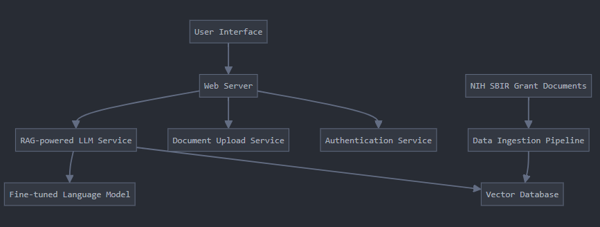

# GrantHero Documentation

Use this guide to setup software for GrantHero.

Write the complete code for every step. Please, do not get lazy (e.g. don't use `...` or `// ...`). Please, be very detailed and write everything that is needed.

Your goal is to completely finish the application and make it production-ready.

1. Backend (Python):

    Web Framework: FastAPI
    Database: PostgreSQL
    Vector Database (Persistent): Pinecone
    Vector Database (In-Memory): Chroma
    LLM: open-source from HuggingFace
    RAG implementation: LangChain

2. Frontend:

    Framework: React with Next.js
    UI Components: Tailwind CSS

3. Data Ingestion and Preprocessing:

    Document Parsing: Docx, PDF, etc.
    PDF parsing: PyPDF2 or pdfminer
    Docx parsing: python-docx
    Text cleaning and preprocessing: NLTK or spaCy

4. Vectorization and Embedding:

    Sentence Transformers for creating embeddings

5. LLM Fine-tuning and RAG:

    Hugging Face Transformers
    LangChain for RAG implementation

## Helpful Links

- [HuggingFace](https://huggingface.co)
- [NIH](https://seed.nih.gov/)
- [Pinecone](https://www.pinecone.io/)

## Flow

